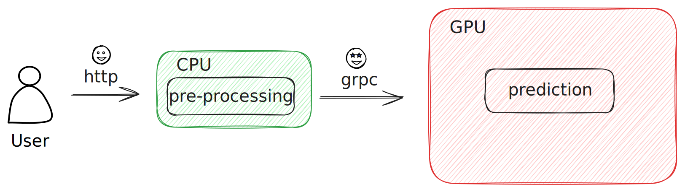
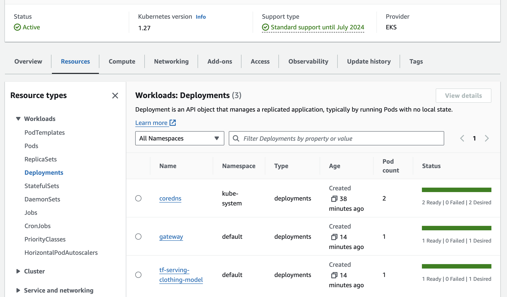

## Split the workflow into pre-processing and prediction



## Start the services in docker compose

```shell
docker compose up --build -d
```

## Test the service
### Option 1: curl
```shell
curl -X POST 'http://127.0.0.1/predict'  -H 'Content-Type: application/json' -d '{
  "url": "http://bit.ly/mlbookcamp-pants"
}'
```
### Option 2: OpenAPI UI (aka Swagger UI)
http://127.0.0.1/docs#/default/predict_predict_post

## Clean-up 

```shell
docker compose down
```

# K8S

install kind

```shell
brew install kind
```

for `kind` it's important to tag image with a tag that is not `latest`

## Experiments with dummy service 

### Build the image

```shell
docker build -t ping:v001 .
docker run --rm -p 9696:9696 ping:v001
curl http://localhost:9696/ping
```

### Create k8s cluster with `kind`

```shell
# create the cluster
kind create cluster
# check that it's running
kubectl cluster-info --context kind-kind
```

List all the services
```shell
kubectl get service
```

## Create deployment from [deployment.yaml](ping/deployment.yaml)

```shell
kubectl apply -f deployment.yaml
```

See deployments and pods
```shell
kubectl get deployment
kubectl get pod
```

See pod's detailed description including error log if present
```shell
kubectl describe pod  ping-deployment-7795dd4bc5-9t2h6
```

The reason the deployment fails is that we need to load the image to the `kind` cluster before k8s can access it
```shell
kind load docker-image ping:v001
```

To be able to access and test the program inside the pod we can use port forwarding

```shell
kubectl port-forward ping-deployment-86946bb9f4-2slb8 9696:9696
```
Given there's only one pod it can be done with

```shell
kubectl port-forward $(kubectl get pod -o=jsonpath='{.items[*].metadata.name}') 9696:9696
# and then test if the application responds by curling it
curl http://localhost:9696/ping
```

## Create service from [service.yaml](ping/service.yaml)

```shell
kubectl apply -f service.yaml 
```

And then to check that it got created
```shell
kubectl get svc
# or
kubectl get service
```

We're on the local kind cluster so we won't be able to access the load balancer on any IP address
So to check that everything is working, we'll need to do port forwarding again

```shell
kubectl port-forward service/ping 8080:80
# and check that there's a response
curl http://localhost:8080/ping
```

# Deploy gateway and tf-serving model on K8s

## Tf-serving model

Give images custom tags and make them available to kind

```shell
docker tag 10-tf-serving-kubernetes-tf_serving:latest tf-serving-model:xception-v4-001
kind load docker-image tf-serving-model:xception-v4-001
```

and apply the [model-deployment.yaml](./k8s-config/model-deployment.yaml)
```shell
kubectl apply -f k8s-config/model-deployment.yaml
```

And test if the things work using port forwarding
```shell
kubectl port-forward tf-serving-clothing-model-7b64f8b64-pgv5j 8500:8500
python gateway.py
curl -X POST 'http://127.0.0.1:8000/predict'  -H 'Content-Type: application/json' -d '{
  "url": "http://bit.ly/mlbookcamp-pants"
}'
```

Then create the service
```shell
kubectl apply -f k8s-config/model-service.yaml
```

Then test again the service using port-forwarding
```shell
kubectl port-forward service/tf-serving-clothing-model 8500:8500
python gateway.py
curl -X POST 'http://127.0.0.1:8000/predict'  -H 'Content-Type: application/json' -d '{
  "url": "http://bit.ly/mlbookcamp-pants"
}'
```

## Gateway

```shell
docker tag 10-tf-serving-kubernetes-gateway:latest tf-serving-gateway:v001 
kind load docker-image tf-serving-gateway:v001 
```

How to specify DNS of the tf-serving service in k8s:
<name-of-service>.<namespace>.svc.cluster.local

So, in our case it's
tf-serving-clothing-model.default.svc.cluster.local

To test if this works we'll enter the ping pod and execute bash there using the following commands:
```shell
kubectl exec -it ping-deployment-86946bb9f4-bmhcm -- bash 
```

And then inside the pod's bash
```shell
apt update
apt install curl
# check that it worked
curl localhost:9696/ping
# then do it through the "network"
curl ping.default.svc.cluster.local/ping
# to check grpc we'll install telnet
curl tf-serving-clothing-model.default.svc.cluster.local:8500
# we get curl: (1) Received HTTP/0.9 when not allowed but it shows that something is running there so we're good
# optionally
apt install telnet
telnet tf-serving-clothing-model.default.svc.cluster.local 8500
```

Finally apply the gateway-deployment:

```shell
kubectl apply -f k8s-config/gateway-deployment.yaml 
```

Again, forward the port and test
```shell
kubectl port-forward gateway-5579ff6cb5-mmnzz 8080:80
curl -X POST 'http://127.0.0.1:8080/predict'  -H 'Content-Type: application/json' -d '{
  "url": "http://bit.ly/mlbookcamp-pants"
}'
```

And lastly create gateway-service
```shell
kubectl apply -f k8s-config/gateway-service.yaml
```

and test it
```shell
kubectl port-forward svc/gateway 8080:80  
curl -X POST 'http://127.0.0.1:8080/predict'  -H 'Content-Type: application/json' -d '{
  "url": "http://bit.ly/mlbookcamp-pants"
}'
```

# Switching `kubectl` context 

```shell
# get available contexts
kubectl config get-contexts   
kubectl config use-context <cluster-name>
```

# Deploy to EKS

to apply the config from [eks-config.yaml](k8s-config/eks-config.yaml) run
```shell
eksctl create cluster -f k8s-config/eks-config.yaml
```

Build x86 image for serving the model
```shell
docker build --platform linux/amd64 -t tf-serving-model:xception-x86-v1 -f image-model.dockerfile .
```

Create ECR if not exists, tag and push model and gateway images
```shell
./push-to-ecr.sh tf-serving-gateway:v001  
./push-to-ecr.sh tf-serving-model:xception-x86-v1  
```

Check the newly created EKS cluster nodes
```shell
kubectl get nodes
```

Apply all the k8s configs
```shell
kubectl apply -f k8s-config/gateway-deployment-eks.yaml
kubectl apply -f k8s-config/gateway-service.yaml
kubectl apply -f k8s-config/model-deployment-eks.yaml
kubectl apply -f k8s-config/model-service.yaml
```

Test it:
```shell
curl -X POST 'http://ad97926a1921442b3a818282a23fd113-979081882.us-west-2.elb.amazonaws.com/predict'  -H 'Content-Type: application/json' -d '{
  "url": "http://bit.ly/mlbookcamp-pants"
}'
```

Delete cluster
```shell
eksctl delete cluster --name mlzoomcamp-cluster
```

And delete ECR repo:
```shell
./destroy-infra.sh
```

If you deleted a cluster and you want to re-create it you first need to delete 
CloudFormation stack created by eksctl
```shell
aws cloudformation delete-stack --stack-name eksctl-mlzoomcamp-cluster-cluster
```

https://stackoverflow.com/questions/70787520/your-current-user-or-role-does-not-have-access-to-kubernetes-objects-on-this-eks

To be able to see the cluster on the AWS Console `aws-auth` configMaps
needs to be edited:
```shell
kubectl edit configmap aws-auth -n kube-system
```
and the following part needs to be added 
```yaml
- "groups":
  - "system:masters"
  "rolearn": "arn:aws:iam::<aws-account-id>:role/<aws-role-name>"
  "username": "<aws-username>"
  ```

  Alternatively, it can be done using `eksctl` in ClusterConfig:
  https://eksctl.io/usage/iam-identity-mappings/

  